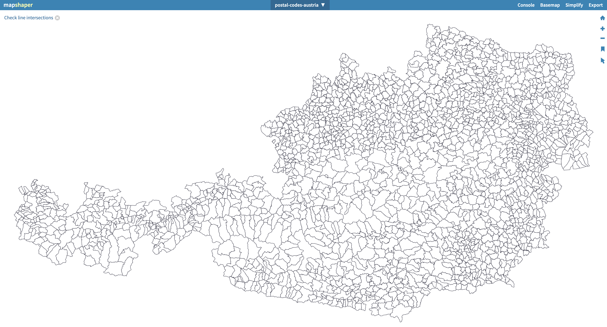

# Postal Codes Austria

Looking for

- `.shp` file? => [output/shp](output/shp/) folder.
- `.svg` file? => [output/svg](output/svg/) folder.
- `.tsx` react component? => [output/react](output/react/) folder.

Interested in the code? => Read on!



## TLDR ✅

We started with two images and used some clever image processing in order to automatically generate the required output files. (.shp data containing the postal code areas of Austria)

An example application can be found at: [immo-preise.at](https://www.immo-preise.at/)

(The postal code areas might change over time. => The output files can be easily updated by using this notebook.)

## Motivation 🧠

We want to create a [choropleth map](https://www.data-to-viz.com/graph/choropleth.html) for the post codes in Austria.

- A choropleth map displays divided geographical areas or regions that are coloured in relation to a numeric variable
- We couldn't find any .shp files for the post code areas in Austria
- Postal codes shp files for Austria are rarely available because they defined as are a collection of addresses and not as a region.

> Postleitzahlen sind so ein Thema: an sich sind diese ja nicht Flächendaten, sondern Punktdaten, da die Postleitzahl an einer Adresse hängt und nicht als eine Fläche definiert ist. Als Fläche gibt es Postleitzahlregionen nicht bis auf die 4, Postleitzahl-Ziffer genau.
>
> Unseres Wissens nach gibt es derzeit keinen frei erhältlichen Datensatz, der die Postleitzahlen (in einer Genauigkeit bis zur 4. Stelle) als Fläche darstellt. Ich glaube einmal gehört zu haben, dass die Post sich selber so einen Flächen-Datensatz berechnet, aber selbst, wenn das stimmt, ist dieser nicht frei verfügbar... [source](https://www.openstreetmap.at/frage/postleitzahlen-at/answer/1659/)

- Gfk seems to sell them add around 750€. see:
  - [Geodata Maps | GfK Global](https://geodata.gfk.com/maps)
  - [Shop GfK Europe Map Edition](https://shop.gfk-geomarketing.de/en/european-countries.html)
  - [GfK worldwide digital maps pdf](https://www.gfk.com/hubfs/GeoData/Downloads/EN_GfK_Worldwide_digital_maps_without%20prices_alle%20Formate.pdf?hsCtaTracking=e3c24b98-0675-4862-98b0-ec817063d674%7Cb5e23eec-235f-423b-97b0-5b0a58470bcf)
- Mapbox also seems to have such data. see: [Boundary Maps for State, County, City & Zipcode | Mapbox](https://www.mapbox.com/boundaries)
- Such maps can also be created with MS Excel. see: [Create a Map chart in Excel](https://support.microsoft.com/en-us/office/create-a-map-chart-in-excel-f2cfed55-d622-42cd-8ec9-ec8a358b593b)
  - Seems to be powered be TomTom or Bing?

## Pre-Condition

- We need two high res images showing the post code areas/contours
  - 1x postal code areas/contours only
  - 1x postal code areas/contours + labels/names
- We created the `map.png` image by creating a map chart in MS Excel

| country | postalCode | Value |
| ------- | ---------- | ----- |
| Austria | 1010       | 0     |
| Austria | 1020       | 0     |
| Austria | 1030       | 0     |
| Austria | 1040       | 0     |
| Austria | 1050       | 0     |
| Austria | ...        | ...   |

- Format chart for easier image processing (remove background, fill color white, etc)
- Make the chart huge (e.g. 166,66" x 90")
  - all (relevant) postal code label should be visible
- Print Chart as PDF (e.g. size A0, scale to fit)
- Open PDF with Mac Preview App and export as png with 600dpi
- Hide postal code labels and repeat
- => results in 2 images:
  - `map.png` and `map-with-labels.png`
  - File size is approx. 30MB (28086x19866 pixels)
  - both files should have the same dimensions

## Usage (MacOS)

The following instructions assume, that python3 is already installed on your machine. We can double check by using:

```
python3 --version
# or
python --version
```

Create a virtual environment for Python:

```
# create virtual environment
python3 -m venv project_env

# activate virtual environment
source project_env/bin/activate
```

Install dependencies

```
pip install -r requirements.txt

# we also need [Tesseract OCR](https://github.com/tesseract-ocr/tesseract)
# I used this command to install Tesseract
brew install tesseract
```

Run Jupyter Notebook

```
jupyter notebook
```

Open notebook in your Browser. Yay!

Once you are done:

```
# in the jupyter notebook
File -> Shut Down
```

```
# deactivate python virtual environment in the terminal
deactivate
```
